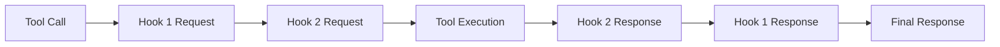

# @civic/hook-common

Common utilities and types for implementing MCP (Model Context Protocol) server hooks.

This package provides the core functionality for creating hooks that can intercept and modify tool calls in MCP servers.

Think of it as a middleware layer that allows you to analyze, modify, or validate tool calls before they are executed,
and to process the responses from those tool calls after execution.

It is designed to be used in combination with the Passthrough Proxy MCP server.

## Installation

```bash
pnpm add @civic/hook-common
```

## Overview

The hook-common package provides:

- **Type definitions** for tool calls, hook responses, and metadata
- **Base client class** for implementing hooks
- **Utilities** for processing and validating hook interactions

## Core Concepts

### Tool Calls

Tool calls use the MCP SDK types directly:

```typescript
import type { CallToolRequest, CallToolResult } from "@modelcontextprotocol/sdk/types.js";

// Tool call request structure
interface CallToolRequest {
  method: "tools/call";
  params: {
    name: string;
    arguments?: unknown;
    _meta?: {
      sessionId?: string;
      // other metadata
    };
  };
}
```

### Hook Results

Hooks return discriminated unions based on the result type:

```typescript
// For request processing
type ToolCallRequestHookResult =
  | { resultType: "continue"; request: CallToolRequest }
  | { resultType: "abort"; reason: string; body?: unknown }
  | { resultType: "respond"; response: CallToolResult };

// For response processing
type ToolCallResponseHookResult =
  | { resultType: "continue"; response: CallToolResult }
  | { resultType: "abort"; reason: string; body?: unknown };
```

### Hook Interface

The interface for implementing hooks:

```typescript
interface Hook {
  name: string;
  processToolCallRequest?(toolCall: CallToolRequest): Promise<ToolCallRequestHookResult>;
  processToolCallResponse?(
    response: CallToolResult,
    originalToolCall: CallToolRequest
  ): Promise<ToolCallResponseHookResult>;
  processToolsList?(request: ListToolsRequest): Promise<ListToolsRequestHookResult>;
  processToolsListResponse?(
    response: ListToolsResult,
    originalRequest: ListToolsRequest
  ): Promise<ListToolsResponseHookResult>;
  processToolCallTransportError?(
    error: unknown,
    originalToolCall: CallToolRequest
  ): Promise<ToolCallTransportErrorHookResult>;
  processToolsListTransportError?(
    error: unknown,
    originalRequest: ListToolsRequest
  ): Promise<ListToolsTransportErrorHookResult>;
}
```

## Creating a Hook

To create a custom hook, extend the `AbstractHook` class:

```typescript
import { AbstractHook } from '@civic/hook-common';
import type { CallToolRequest, ToolCallRequestHookResult } from '@civic/hook-common';

export class MyCustomHook extends AbstractHook {
  get name(): string {
    return 'my-custom-hook';
  }

  async processToolCallRequest(toolCall: CallToolRequest): Promise<ToolCallRequestHookResult> {
    // Analyze the tool call
    console.log(`Processing request for tool: ${toolCall.params.name}`);
    
    // Optionally modify the tool call
    const modifiedToolCall = {
      ...toolCall,
      params: {
        ...toolCall.params,
        arguments: {
          ...toolCall.params.arguments,
          injected: 'value'
        }
      }
    };

    // Return response
    return {
      resultType: 'continue',
      request: modifiedToolCall
    };
  }

  async processToolCallResponse(
    response: CallToolResult,
    originalToolCall: CallToolRequest
  ): Promise<ToolCallResponseHookResult> {
    // Process the tool's response
    console.log(`Processing response for tool: ${originalToolCall.params.name}`);
    
    // Optionally modify the response
    return {
      resultType: 'continue',
      response: response
    };
  }
}
```

## Hook Execution Flow

1. **Request Processing**: When a tool is called, hooks process the request in order
2. **Tool Execution**: If all hooks return "continue", the tool executes
3. **Response Processing**: Hooks process the tool's response in reverse order



## Type Safety

All types are exported with Zod schemas for runtime validation:

```typescript
import { ToolCallSchema, HookResponseSchema } from '@civic/hook-common';

// Validate incoming data
const validatedToolCall = ToolCallSchema.parse(incomingData);

// Validate hook responses
const validatedResponse = HookResponseSchema.parse(hookResponse);
```

## Examples

### Logging Hook

```typescript
export class LoggingHook extends AbstractHook {
  get name(): string {
    return 'logging-hook';
  }

  async processToolCallRequest(toolCall: CallToolRequest): Promise<ToolCallRequestHookResult> {
    console.log(`[${new Date().toISOString()}] Tool called: ${toolCall.params.name}`);
    console.log('Arguments:', JSON.stringify(toolCall.params.arguments, null, 2));
    
    return {
      resultType: 'continue',
      request: toolCall
    };
  }

  async processToolCallResponse(
    response: CallToolResult,
    originalToolCall: CallToolRequest
  ): Promise<ToolCallResponseHookResult> {
    console.log(`[${new Date().toISOString()}] Response from: ${originalToolCall.params.name}`);
    console.log('Response:', JSON.stringify(response, null, 2));
    
    return {
      resultType: 'continue',
      response: response
    };
  }
}
```

### Validation Hook

```typescript
export class ValidationHook extends AbstractHook {
  get name(): string {
    return 'validation-hook';
  }

  async processToolCallRequest(toolCall: CallToolRequest): Promise<ToolCallRequestHookResult> {
    // Validate tool calls
    if (toolCall.params.name === 'dangerous-tool') {
      return {
        resultType: 'abort',
        reason: 'This tool is not allowed',
        body: null
      };
    }
    
    return {
      resultType: 'continue',
      request: toolCall
    };
  }

  async processToolCallResponse(
    response: CallToolResult,
    originalToolCall: CallToolRequest
  ): Promise<ToolCallResponseHookResult> {
    return {
      resultType: 'continue',
      response: response
    };
  }
}
```

## API Reference

### Types

- `Hook` - Interface for implementing hooks
- `ToolCallRequestHookResult` - Result type for request processing
- `ToolCallResponseHookResult` - Result type for response processing
- `ListToolsRequestHookResult` - Result type for tools list request processing
- `ListToolsResponseHookResult` - Result type for tools list response processing

### Schemas

- `ToolCallRequestHookResultSchema` - Zod schema for request hook result validation
- `ToolCallResponseHookResultSchema` - Zod schema for response hook result validation
- `ListToolsRequestHookResultSchema` - Zod schema for tools list request result validation
- `ListToolsResponseHookResultSchema` - Zod schema for tools list response result validation

### Classes

- `AbstractHook` - Abstract base class for implementing hooks with default pass-through implementations

## License

MIT