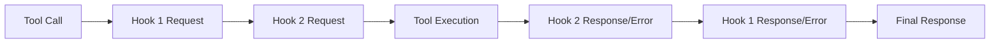

# @civic/hook-common

Common utilities and types for implementing MCP (Model Context Protocol) server hooks.

This package provides the core functionality for creating hooks that can intercept and modify tool calls in MCP servers.

Think of it as a middleware layer that allows you to analyze, modify, or validate tool calls before they are executed,
and to process the responses from those tool calls after execution.

It is designed to be used in combination with the Passthrough Proxy MCP server.

## Installation

```bash
pnpm add @civic/hook-common
```

## Overview

The hook-common package provides:

- **Type definitions** for tool calls, hook responses, and metadata
- **Base client class** for implementing hooks
- **Utilities** for processing and validating hook interactions

## Core Concepts

### Tool Calls

Tool calls use the MCP SDK types directly:

```typescript
import type { CallToolRequest, CallToolResult } from "@modelcontextprotocol/sdk/types.js";

// Tool call request structure
interface CallToolRequest {
  method: "tools/call";
  params: {
    name: string;
    arguments?: unknown;
    _meta?: {
      sessionId?: string;
      // other metadata
    };
  };
}
```

### Hook Results

Hooks return discriminated unions based on the result type:

```typescript
// For request processing
type ToolCallRequestHookResult =
  | { resultType: "continue"; request: CallToolRequest }
  | { resultType: "abort"; reason: string; body?: unknown }
  | { resultType: "respond"; response: CallToolResult };

// For response processing
type ToolCallResponseHookResult =
  | { resultType: "continue"; response: CallToolResult }
  | { resultType: "abort"; reason: string; body?: unknown };
```

### Hook Interface

The interface for implementing hooks (v0.4.1+):

```typescript
interface RequestExtra {
  requestId: string | number;
  sessionId?: string;
}

interface Hook {
  get name(): string;
  
  // Request processing methods - receive RequestExtra as second parameter
  processCallToolRequest?(
    request: CallToolRequest, 
    requestExtra: RequestExtra
  ): Promise<CallToolRequestHookResult>;
  
  processListToolsRequest?(
    request: ListToolsRequest,
    requestExtra: RequestExtra
  ): Promise<ListToolsRequestHookResult>;
  
  processInitializeRequest?(
    request: InitializeRequest,
    requestExtra: RequestExtra
  ): Promise<InitializeRequestHookResult>;
  
  // Response processing methods - receive RequestExtra as third parameter
  processCallToolResult?(
    response: CallToolResult,
    originalCallToolRequest: CallToolRequest,
    requestExtra: RequestExtra
  ): Promise<CallToolResponseHookResult>;
  
  processListToolsResult?(
    response: ListToolsResult,
    originalRequest: ListToolsRequest,
    requestExtra: RequestExtra
  ): Promise<ListToolsResponseHookResult>;
  
  processInitializeResult?(
    response: InitializeResult,
    originalRequest: InitializeRequest,
    requestExtra: RequestExtra
  ): Promise<InitializeResponseHookResult>;
  
  // ... other methods follow the same pattern
}
```

## Creating a Hook

To create a custom hook, extend the `AbstractHook` class:

```typescript
import { AbstractHook } from '@civic/hook-common';
import type { 
  CallToolRequest, 
  CallToolResult,
  RequestExtra,
  CallToolRequestHookResult,
  CallToolResponseHookResult 
} from '@civic/hook-common';

export class MyCustomHook extends AbstractHook {
  get name(): string {
    return 'my-custom-hook';
  }

  async processCallToolRequest(
    request: CallToolRequest,
    requestExtra: RequestExtra
  ): Promise<CallToolRequestHookResult> {
    // Use requestId for tracking
    console.log(`[${requestExtra.requestId}] Processing request for tool: ${request.params.name}`);
    console.log(`Session ID: ${requestExtra.sessionId}`);
    
    // Optionally modify the tool call
    const modifiedRequest = {
      ...request,
      params: {
        ...request.params,
        arguments: {
          ...request.params.arguments,
          injected: 'value'
        }
      }
    };

    // Return response
    return {
      resultType: 'continue',
      request: modifiedRequest
    };
  }

  async processCallToolResult(
    response: CallToolResult,
    originalCallToolRequest: CallToolRequest,
    requestExtra: RequestExtra
  ): Promise<CallToolResponseHookResult> {
    // Use the same requestId to correlate with the request
    console.log(`[${requestExtra.requestId}] Processing response for tool: ${originalCallToolRequest.params.name}`);
    
    // Optionally modify the response
    return {
      resultType: 'continue',
      response: response
    };
  }
}
```

## Request Tracking with RequestExtra (v0.4.1+)

The `RequestExtra` parameter enables powerful request tracking capabilities:

- **Request ID**: Unique identifier for each request, enabling correlation between request and response processing
- **Session ID**: Consistent identifier throughout a client session, useful for session-based analytics

### Use Cases

1. **Request/Response Correlation**: Match responses to their originating requests without maintaining state
2. **Distributed Tracing**: Track requests across multiple hooks and services
3. **Rate Limiting**: Implement per-session or per-request rate limiting
4. **Audit Logging**: Create comprehensive audit trails with request/session context
5. **Performance Monitoring**: Measure processing time for each request

## Hook Execution Flow

1. **Request Processing**: When a tool is called, hooks process the request in order
2. **Tool Execution**: If all hooks return "continue", the tool executes
3. **Response Processing**: Hooks process the tool's response in reverse order

4. **Error Processing** (v0.4.2+): Hooks can intercept and handle errors through dedicated error callbacks



### Error Handling (v0.4.2+)

Hooks can now process errors that occur during request processing:

```typescript
interface Hook {
  // Error processing methods
  processCallToolError?(
    error: HookChainError,
    originalRequest: CallToolRequest,
    requestExtra: RequestExtra
  ): Promise<CallToolErrorHookResult>;
  
  processListToolsError?(
    error: HookChainError,
    originalRequest: ListToolsRequest,
    requestExtra: RequestExtra
  ): Promise<ListToolsErrorHookResult>;
  
  // ... other error methods
}
```

Error processing allows hooks to:
- **Transform errors**: Modify error messages or codes
- **Recover from errors**: Convert an error into a successful response
- **Pass through errors**: Let the error continue unchanged

```typescript
export class ErrorHandlingHook extends AbstractHook {
  async processCallToolError(
    error: HookChainError,
    originalRequest: CallToolRequest,
    requestExtra: RequestExtra
  ): Promise<CallToolErrorHookResult> {
    // Log the error
    console.error(`Error in tool ${originalRequest.params.name}:`, error);
    
    // Option 1: Transform the error
    throw new Error(`Custom error: ${error.message}`);
    
    // Option 2: Recover from the error
    return {
      resultType: 'respond',
      response: {
        content: [{ type: 'text', text: 'Recovered from error' }]
      }
    };
    
    // Option 3: Pass through unchanged
    return { resultType: 'continue' };
  }
}
```

## Type Safety

All types are exported with Zod schemas for runtime validation:

```typescript
import { 
  ToolCallRequestHookResultSchema,
  ToolCallResponseHookResultSchema 
} from '@civic/hook-common';

// Validate hook request results
const validatedRequestResult = ToolCallRequestHookResultSchema.parse(hookRequestResult);

// Validate hook response results
const validatedResponseResult = ToolCallResponseHookResultSchema.parse(hookResponseResult);
```

## Examples

### Logging Hook

```typescript
export class LoggingHook extends AbstractHook {
  get name(): string {
    return 'logging-hook';
  }

  async processCallToolRequest(request: CallToolRequest): Promise<ToolCallRequestHookResult> {
    console.log(`[${new Date().toISOString()}] Tool called: ${toolCall.params.name}`);
    console.log('Arguments:', JSON.stringify(toolCall.params.arguments, null, 2));
    
    return {
      resultType: 'continue',
      request: toolCall
    };
  }

  async processCallToolResult(
    response: CallToolResult,
    originalCallToolRequest: CallToolRequest
  ): Promise<ToolCallResponseHookResult> {
    console.log(`[${new Date().toISOString()}] Response from: ${originalCallToolRequest.params.name}`);
    console.log('Response:', JSON.stringify(response, null, 2));
    
    return {
      resultType: 'continue',
      response: response
    };
  }
}
```

### Validation Hook

```typescript
export class ValidationHook extends AbstractHook {
  get name(): string {
    return 'validation-hook';
  }

  async processCallToolRequest(request: CallToolRequest): Promise<ToolCallRequestHookResult> {
    // Validate tool calls
    if (toolCall.params.name === 'dangerous-tool') {
      return {
        resultType: 'abort',
        reason: 'This tool is not allowed',
        body: null
      };
    }
    
    return {
      resultType: 'continue',
      request: toolCall
    };
  }

  async processCallToolResult(
    response: CallToolResult,
    originalCallToolRequest: CallToolRequest
  ): Promise<ToolCallResponseHookResult> {
    return {
      resultType: 'continue',
      response: response
    };
  }
}
```

## API Reference

### Types

- `Hook` - Interface for implementing hooks
- `ToolCallRequestHookResult` - Result type for request processing
- `ToolCallResponseHookResult` - Result type for response processing
- `ListToolsRequestHookResult` - Result type for tools list request processing
- `ListToolsResponseHookResult` - Result type for tools list response processing
- `ToolCallTransportErrorHookResult` - Result type for tool call transport error processing
- `ListToolsTransportErrorHookResult` - Result type for tools list transport error processing
- `InitializeRequestHookResult` - Result type for initialize request processing
- `InitializeResponseHookResult` - Result type for initialize response processing
- `InitializeTransportErrorHookResult` - Result type for initialize transport error processing
- `TransportError` - Error type for transport-layer errors
- `CallToolRequest`, `CallToolResult`, `ListToolsRequest`, `ListToolsResult`, `InitializeRequest`, `InitializeResult` - Re-exported from MCP SDK

### Schemas

- `ToolCallRequestHookResultSchema` - Zod schema for request hook result validation
- `ToolCallResponseHookResultSchema` - Zod schema for response hook result validation
- `ListToolsRequestHookResultSchema` - Zod schema for tools list request result validation
- `ListToolsResponseHookResultSchema` - Zod schema for tools list response result validation
- `ToolCallTransportErrorHookResultSchema` - Zod schema for tool call transport error validation
- `ListToolsTransportErrorHookResultSchema` - Zod schema for tools list transport error validation
- `InitializeRequestHookResultSchema` - Zod schema for initialize request validation
- `InitializeResponseHookResultSchema` - Zod schema for initialize response validation
- `InitializeTransportErrorHookResultSchema` - Zod schema for initialize transport error validation
- `TransportErrorSchema` - Zod schema for transport error validation

### Classes

- `AbstractHook` - Abstract base class for implementing hooks with default pass-through implementations

### Utilities

- `createHookRouter` - Creates a tRPC router for hook implementation
- `createLocalHookClient` - Creates a local client for a hook instance

## License

MIT